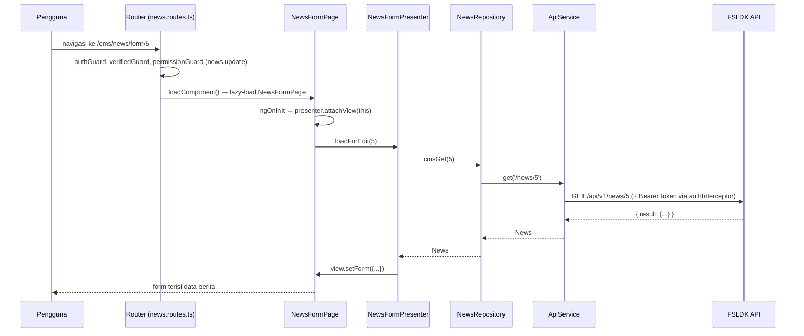

# Arsitektur & Alur Sistem — FSLDK Web

[← Kembali ke README](../README.md) · [Lihat Panduan Instalasi →](./INSTALLATION.md)

Dokumen ini menjelaskan bagaimana `fsldk-web` disusun secara internal: pola modul fitur, pola MVP (Presenter/View) per halaman, alur permintaan, sesi & autentikasi, routing, serta konvensi yang dijaga konsisten di seluruh kode.

---

## 1. Filosofi Arsitektur

`fsldk-web` menerapkan **arsitektur modul fitur (feature module)** dengan pemisahan **MVP (Model–View–Presenter)** di tiap halaman — bukan komponen "gemuk" yang mencampur tampilan, state, dan panggilan API dalam satu file.

```
Route  →  Page (View)  →  Presenter  →  Repository  →  ApiService (HTTP)  →  FSLDK API
```

| Lapisan | Tanggung Jawab | Tidak Boleh |
|---|---|---|
| **Page** (`*.page.ts` + `*.page.html`) | Merender UI, meneruskan aksi pengguna ke Presenter, mengimplementasikan interface `*View` miliknya sendiri (signal lokal untuk state tampilan) | Memanggil repository/HTTP langsung, menyimpan logika bisnis |
| **Presenter** (`*.presenter.ts`) | Seluruh logika & state: memanggil Repository, memvalidasi input, memutuskan navigasi | Menyentuh DOM atau `ChangeDetectorRef` langsung — semua update UI lewat method `View` |
| **View** (`*.view.ts`) | Interface kontrak: daftar method yang boleh dipanggil Presenter pada Page (`setLoading`, `setData`, `navigateToX`, dst.) | Berisi implementasi apa pun — murni tipe |
| **Repository** (`repositories/<modul>.repository.ts`) | Permukaan data publik modul — dipakai lintas modul & oleh presenter manapun | Mengetahui detail Angular (`Router`, signal komponen) |
| **Api Service** (`services/<modul>-api.service.ts`) | Panggilan HTTP mentah ke satu grup endpoint, lewat `ApiService` bersama | Logika bisnis atau transformasi selain tipe response |
| **Entity** (`entities/*.ts`) | Bentuk data domain modul (interface murni) | Method/function apa pun |

Aliran dependensi selalu satu arah: Page → Presenter → Repository → ApiService. Presenter tidak pernah tahu bahwa dirinya dipakai dari komponen Angular tertentu — ia hanya bergantung pada interface `View`, sehingga mudah diuji terpisah dengan mock View.

---

## 2. Struktur Modul (Feature Module + MVP)

Setiap fitur berada di `src/app/modules/<nama>/`, mengikuti pola proyek referensi internal (`phantom-lancer`). Contoh modul `news`:

```
modules/news/
├── entities/
│   ├── news.ts                    # interface News — murni data
│   └── news-category.ts
├── services/
│   └── news-api.service.ts        # panggilan HTTP mentah (get/post/put/patch/delete)
├── repositories/
│   └── news.repository.ts         # permukaan data publik modul, dipakai lintas modul
├── pages/
│   ├── public-index/               # daftar berita (publik)
│   │   ├── news.public-index.page.html
│   │   ├── news.public-index.page.ts
│   │   ├── news.public-index.presenter.ts
│   │   └── news.public-index.view.ts
│   ├── public-detail/              # detail berita (publik, by slug)
│   ├── index/                      # manajemen berita (CMS)
│   └── form/                       # tambah/ubah berita (CMS)
├── news.path.ts                    # konstanta path/URL modul ini
└── news.routes.ts                  # factory `() => Routes`, lazy via loadComponent
```

**Modul yang ada saat ini** (umumnya satu-satu berpasangan dengan modul backend `fsldk-api`, ditambah `home` untuk Beranda) — daftar ini bertambah seiring fitur baru; anggap sebagai peta, bukan satu-satunya sumber kebenaran (jalankan `ls src/app/modules/` untuk daftar aktual):

| Modul | Isi |
|---|---|
| `auth` | Halaman login, daftar, verifikasi email, lupa password, reset password |
| `user` | `AuthRepository` (sesi/token — lihat §5), manajemen pengguna CMS, pencarian @mention komentar (`UserRepository.searchMentionable`) |
| `role` | Manajemen role & penetapan permission |
| `permission` | Menu sidebar dinamis (`GET /me/menus`) & daftar permission |
| `news` | Berita — publik (list/detail) & CMS (manajemen/form) |
| `article` | Artikel — publik (list/detail) & CMS (manajemen/form) |
| `event` | Event — publik (list/detail, countdown, tab dokumentasi) & CMS (manajemen/form) |
| `catalogbook` | Perpustakaan/katalog buku — publik (list/detail, like) & CMS (manajemen/form) |
| `financeformat` | Format Keuangan (unduhan dokumen) — publik & CMS |
| `goods` | FSLDK Goods — katalog produk (bukan e-commerce; "Beli Sekarang" murni redirect ke `purchaseUrl`) & kategori, publik & CMS |
| `schedule` | Jadwal kegiatan (kajian/rapat/daurah/dst.) — publik & CMS |
| `structure` | Struktur Organisasi — arsip kepengurusan per periode/batch (bukan section "Tentang" Beranda), CMS-only |
| `gallery` | Galeri foto per album — publik & CMS |
| `contact` | Kotak masuk pesan form "Hubungi Kami" (bukan section "Kontak" Beranda) — CMS-only |
| `subscription` | Newsletter/subscriber — form berlangganan publik & CMS |
| `statistic` | Statistik jaringan nasional (sebaran LDK/Puskomda) — publik-only, tanpa CMS |
| `zakat` | Kalkulator zakat (7 jenis) — publik-only, kalkulasi di browser, satu panggilan API (harga emas) |
| `dynamicform` | Formulir Dinamis — form builder ad-hoc generik (beda dari `submission-form`, lihat di bawah), draft-per-sesi, opsional sinkron Google Sheets |
| `comment` | Komentar — widget publik (`comment-section`/`comment-item`, dipakai lintas modul `article`/`news`/`event`) & CMS moderasi (lihat §9) |
| `shortlink` | Manajemen shortlink CMS (buat/lihat/ubah/hapus, salin tautan pendek) + halaman publik pengajuan (`shortlink/ajukan`, tanpa login) + antrian moderasi CMS (`shortlink-requests`, approve/reject) |
| `qrcode` | Manajemen QR Code CMS (buat/lihat/ubah/hapus, editor kustomisasi warna/ikon/caption, generate gambar QR) + halaman publik pengajuan (`qrcode/ajukan`, tanpa login) + antrian moderasi CMS (`qrcoderequest`, approve/reject) + halaman publik detail/unduh QR (`/qr/:id`) — cerminan penuh modul `shortlink` di atas (lihat ARCHITECTURE.md `fsldk-api` §2/§12) |
| `kantong-amal` | Crowdfunding donasi — **satu** modul frontend memetakan **empat** modul backend (`campaign`/`donation`/`wallet`/`withdrawal`, lihat ARCHITECTURE.md `fsldk-api` §2), plus laporan keuangan. Halaman publik (donasi, status pembayaran, resi) & CMS (kelola campaign, monitoring donasi, penarikan dana, laporan/audit) |
| `setting` | App Settings CMS (`/cms/settings`) — konfigurasi runtime key-value generik, Superadmin-only |
| `jobqueue` | Dashboard monitoring antrian pengiriman WhatsApp/email asinkron, Superadmin-only |
| `dashboard` | Ringkasan **tier-aware** (Utama/LDK/Puskomda/Puskomnas) — bentuk widget berbeda sesuai tier shell CMS aktif (lihat §7) |
| `organization` | Hierarki LDK/Puskomda/Puskomnas — profil, daftar wilayah/nasional, `OrganizationRepository` sekaligus pemilik state organization switcher (§7, **bukan** yang menentukan tier — lihat catatan penting di §7) |
| `submission-form` | Form builder (Super Admin) — form/version/section/field/option pendataan Levelisasi & Sensus Kader. **Beda** dari `dynamicform` (di atas): ini khusus dua form baku (Levelisasi LDK, Sensus Kader), bukan form ad-hoc bebas |
| `submission` | Pengisian, status, & review pendataan — satu modul dipakai LDK (isi form, lihat status), Puskomda/Puskomnas (verifikasi/persetujuan/penetapan level/publikasi), dan LDK lagi (persetujuan kader) sekaligus, dibedakan lewat permission dari `/me/menus`, bukan role hardcode di komponen |
| `report` | Laporan Wilayah/Nasional — tabel submission + ekspor Excel/CSV |
| `home` | Beranda — hero, berita terbaru, serta section Tentang & Kontak (teks tetap/hardcoded, bukan dari API) |

> Konten Landing Page (visi/misi/section "Kontak" — alamat/media sosial) sengaja **tidak** dikelola via CMS/database — sesuai keputusan produk, teksnya statis langsung di `modules/home/pages/index/home.index.page.ts`. Tidak ada lagi modul `content`/`about` terpisah untuk INI. Jangan bingung dengan modul `structure` dan `contact` di atas — keduanya adalah fitur CMS asli (arsip kepengurusan & kotak masuk pesan) yang namanya kebetulan mirip, ditambahkan belakangan, bukan reinkarnasi modul `content` yang lama.

### Aturan lintas modul

Meng-import `entities`/`repositories` dari modul lain **diperbolehkan dan wajar** — repository adalah permukaan publik modul. Contoh: `modules/home` men-inject `NewsRepository` untuk daftar berita terbaru; hampir semua halaman CMS men-inject `AuthRepository` dari `modules/user` untuk cek `hasPermission(...)`.

---

## 3. Pola MVP: Page ↔ Presenter ↔ View

Contoh nyata dari `modules/news/pages/form/`:

```ts
// news.form.view.ts — kontrak yang harus diimplementasikan Page
export interface NewsFormView {
  setCategories(categories: NewsCategory[]): void;
  setForm(form: NewsFormValue): void;
  setSaving(saving: boolean): void;
  navigateToIndex(): void;
}
```

```ts
// news.form.presenter.ts — seluruh logika & panggilan repository
@Injectable()
export class NewsFormPresenter extends BasePresenter<NewsFormView> {
  private newsRepo = inject(NewsRepository);
  save(editId: number | null, form: NewsFormValue): void {
    this.view.setSaving(true);
    // ...panggil repository, lalu:
    this.view.setSaving(false);
    this.view.navigateToIndex();
  }
}
```

```ts
// news.form.page.ts — Page mengimplementasikan View, meneruskan aksi ke Presenter
@Component({ providers: [NewsFormPresenter], templateUrl: './news.form.page.html' })
export class NewsFormPage implements OnInit, NewsFormView {
  private presenter = inject(NewsFormPresenter);
  saving = signal(false);

  ngOnInit(): void { this.presenter.attachView(this); }
  save(): void { this.presenter.save(this.editId, this.form); }

  setSaving(saving: boolean): void { this.saving.set(saving); }
  navigateToIndex(): void { this.router.navigate(['/cms/news']); }
}
```

`attachView(this)` dipanggil di `ngOnInit` (atau constructor untuk halaman sederhana tanpa dependensi route) — inilah yang menyambungkan Presenter ke Page. Plumbing `attachView`/`protected view!: TView` disediakan oleh kelas dasar bersama [`core/mvp/base.presenter.ts`](../src/app/core/mvp/base.presenter.ts) sehingga tidak perlu ditulis ulang di setiap presenter.

**Mengapa dipisah begini?** Presenter murni TypeScript (tidak bergantung Angular template) sehingga:
- Logika bisa diuji tanpa merender komponen.
- Page tetap tipis — hanya signal lokal + binding template.
- Kontrak `View` membuat jelas *apa saja* yang bisa diubah Presenter pada UI, tanpa Presenter perlu tahu *bagaimana* itu ditampilkan.

**`@Component({ providers: [XxxPresenter] })`** membuat setiap instansiasi Page mendapat Presenter baru (scoped ke komponen), sehingga state tidak bocor antar navigasi ke halaman yang sama.

---

## 4. Alur Permintaan (Request Lifecycle)

Contoh: pengguna membuka `/cms/news/form/5` untuk mengubah sebuah berita.



---

## 5. Sesi & Autentikasi

`AuthRepository` (`modules/user/repositories/auth.repository.ts`, `providedIn: 'root'`) adalah **satu-satunya sumber kebenaran sesi** di seluruh aplikasi — analog dengan repository sesi pada proyek referensi internal yang menaruh logika autentikasi di modul `user`, bukan modul `auth` terpisah.

```
AuthApiService (HTTP mentah /auth/*)
        ↓
AuthSessionService (localStorage: token + user, tanpa HTTP)
        ↓
AuthRepository (orkestrasi + signal `user`/`isLoggedIn`/`isVerified`)
```

`AuthRepository` di-inject langsung oleh:
- **`core/guards/guards.ts`** — `authGuard`, `loginGuard`, `verifiedGuard`, `permissionGuard`
- **`core/interceptors/auth.interceptor.ts`** — menyisipkan `Authorization: Bearer <token>`
- **`core/interceptors/error.interceptor.ts`** — logout otomatis saat `401`
- **`layouts/public-layout.component.ts`** & **`layouts/cms-layout.component.ts`** — status login, nama pengguna

Modul `modules/auth/` sendiri **hanya berisi halaman** (login/register/verify-email/forgot-password/reset-password) — presenternya memanggil method di `AuthRepository`, tidak menduplikasi state sesi.

**Google OAuth**: `shared/google-button.component.ts` memuat Google Identity Services dari `environment.googleClientId`; bila kosong, halaman login/daftar menampilkan tombol placeholder dengan pesan info. Token ID dari Google diteruskan ke `AuthRepository.loginGoogle(idToken)` → `POST /auth/google`.

**Unggah gambar**: `shared/image-upload.component.ts` (`<app-image-upload [(value)]="form.xxxImage">`) adalah komponen dumb reusable — dipakai oleh form Artikel & Berita CMS untuk field "Gambar Utama". Alih-alih menempel URL manual, pengguna memilih berkas lewat `<input type="file">` tersembunyi; komponen langsung mengunggahnya lewat `core/services/upload.service.ts` (`POST /uploads/image`, `multipart/form-data`) dan memancarkan URL hasil unggahan ke field form via banana-in-a-box `[(value)]`. Validasi tipe/ukuran berkas dilakukan di sisi klien (JPG/PNG/WEBP/GIF, maks. 5MB) sebelum diunggah, meniru batas yang sama di endpoint backend.

**Unggah PDF**: `shared/pdf-upload.component.ts` (`<app-pdf-upload [(value)]="form.articlePdf">`) — pola sama dengan `image-upload.component.ts`, tapi lewat `UploadService.uploadDocument()` (`POST /uploads/document`, field `document`, maks 20MB, hanya `application/pdf`). Dipakai khusus oleh form Artikel: naskah lengkap artikel dibaca pengunjung lewat PDF ini di landing page, bukan lewat halaman detail berbasis HTML — `articleIntro` (lihat di bawah) hanya pembuka singkat sebelum tombol "Baca Artikel Lengkap (PDF)".

**Editor konten (TinyMCE)**: `shared/rich-text-editor.component.ts` (`<app-rich-text-editor [(value)]="form.xxxIntro">` untuk Artikel, `form.xxxContent` untuk Berita) membungkus `@tinymce/tinymce-angular` — **self-hosted lewat npm** (`tinymce` package), bukan TinyMCE Cloud, sehingga tidak butuh API key. Berkas `node_modules/tinymce` disalin ke `dist/fsldk-web/browser/tinymce` lewat entri `assets` tambahan di `angular.json`. Lokasi skrip **wajib** disuntik lewat token DI `TINYMCE_SCRIPT_SRC` (`providers: [{ provide: TINYMCE_SCRIPT_SRC, useValue: 'tinymce/tinymce.min.js' }]`) — menulisnya sebagai atribut template `tinymceScriptSrc="..."` TIDAK berfungsi (bukan `@Input()` pada wrapper ini, hanya parameter constructor), dan diam-diam jatuh ke TinyMCE Cloud kalau lupa. `licenseKey="gpl"` (Input khusus pada `<editor>`, bukan field di `init`) menyatakan penggunaan edisi open-source (GPL-2.0-or-later), bukan lisensi berbayar. Tombol sisip gambar pada editor memakai `images_upload_handler` yang memanggil `UploadService` yang sama dengan `image-upload.component.ts` (`POST /uploads/image`), jadi gambar yang disisipkan di dalam konten juga tersimpan di backend sendiri, bukan base64 inline. Output HTML-nya dirender lewat `[innerHTML]` di halaman publik (`article.public-detail`, `news.public-detail`).

**Konsep Artikel vs. Berita**: keduanya modul terpisah dengan struktur mirip, tapi model publikasinya berbeda (lihat migrasi `0001_init.up.sql` di repo `fsldk-api`). Artikel: field `articleContent` diganti `articleIntro` + ditambah `articleWriter`/`articleEditor`/`articlePdf` — pendahuluan singkat di web, naskah lengkap dibaca via PDF. Berita: tetap full-HTML di halaman detail seperti semula (`newsContent`, `newsExcerpt`, tanpa PDF), hanya ditambah byline eksplisit `newsPublisher`/`newsReporter`/`newsEditor` (reporter wajib, publisher & editor opsional) — bukan PDF. Jangan menyamakan pola keduanya saat menambah field baru ke salah satu modul.

---

## 6. Routing & Lazy Loading

Setiap modul mengekspor factory `() => Routes` di `<modul>.routes.ts`, memakai `loadComponent` (bukan `component` langsung) agar tiap halaman menjadi *lazy chunk* terpisah — diverifikasi lewat `ng build` (lihat daftar "Lazy chunk files" pada output build).

[`app.routes.ts`](../src/app/app.routes.ts) mengagregasi seluruh route modul di bawah **empat** layout shell component: `PublicLayoutComponent` (landing page, dengan `AuthLayoutComponent` bersarang di dalamnya untuk halaman login/daftar/dst.), `CmsLayoutComponent` (dipakai ulang untuk **empat** route tree CMS bertier berbeda — lihat di bawah), dan `KaderLayoutComponent` (portal self-service ringkas untuk role Kader — sidebar minimal Pendataan/Status/Persetujuan Kader/Profil LDK, tanpa dashboard statistik karena Kader tidak bertier organisasi, lihat `modules/dashboard` §2 dan API §14 `fsldk-api`).

Halaman autentikasi (login/daftar/lupa-password/dst.) sengaja **bersarang di dalam** `PublicLayoutComponent`, bukan shell terpisah — persis pola ldksyahid-app, karena halaman ini untuk masyarakat umum (bukan hanya pengguna dengan akses CMS) sehingga memakai navbar & footer landing page yang sama. `AuthLayoutComponent` kini hanya membingkai kartu form + panel visual (ayat & poin komunitas), bukan shell penuh:

```ts
export const routes: Routes = [
  {
    path: '', component: PublicLayoutComponent,
    children: [
      ...homeRoutes(), ...newsPublicRoutes(), ...articlePublicRoutes(),
      { path: '', component: AuthLayoutComponent, children: [...authRoutes()] },
    ],
  },
  // 4 shell CMS TERPISAH memakai component YANG SAMA (CmsLayoutComponent) — tier
  // datang dari route `data`, bukan dari toggle runtime (lihat §7 untuk detail
  // & kenapa ini beda dari "organization switcher").
  { path: 'cms', component: CmsLayoutComponent, canActivate: [authGuard], data: { tier: 'FSLDK' }, children: [...dashboardRoutes(), ...userRoutes(), ...] },
  { path: 'cms-ldk', component: CmsLayoutComponent, canActivate: [authGuard], data: { tier: 'LDK' }, children: [...dashboardRoutes(), ...organizationRoutes(), ...submissionRoutes()] },
  { path: 'cms-puskomda', component: CmsLayoutComponent, canActivate: [authGuard], data: { tier: 'PUSKOMDA' }, children: [...] },
  { path: 'cms-puskomnas', component: CmsLayoutComponent, canActivate: [authGuard], data: { tier: 'PUSKOMNAS' }, children: [...] },
  { path: 'kader', component: KaderLayoutComponent, canActivate: [authGuard], children: [...kaderRoutes()] },
];
```

Setiap dari keempat shell CMS memfilter menu sidebar-nya sendiri dari `GET /me/menus` berdasarkan **prefix route** (`lk_permission.menuRoute` sudah di-set per shell lewat migration backend `0010`) — anggota `children` yang sama (mis. `dashboardRoutes()`, `submissionRoutes()`) boleh dipasang di lebih dari satu shell karena akses tetap dijaga `permissionGuard` per halaman, bukan oleh shell mana yang memuatnya.

Menambah halaman baru **tidak pernah mengedit `app.routes.ts` untuk isi rute** — cukup tambahkan entri di `<modul>.routes.ts` milik modul terkait; `app.routes.ts` hanya merangkai.

Guard dipasang berlapis, berurutan (`canActivate: [verifiedGuard, permissionGuard]`):

| Guard | Fungsi |
|---|---|
| `authGuard` | Wajib login (dipasang di level layout `cms`, bukan per-rute); jika belum login, redirect ke `/login?returnUrl=<url tujuan>` |
| `loginGuard` | Kebalikannya — cegah pengguna yang sudah login membuka `/login`, `/daftar`, dst. |
| `verifiedGuard` | Wajib email terverifikasi (redirect ke `/verifikasi-email` bila belum) |
| `permissionGuard` | Cek `route.data.permission` terhadap `AuthRepository.hasPermission(code)` |

**Redirect pasca-login** (`LoginPresenter`/`RegisterPresenter` → `LoginView.navigateAfterLogin(cmsPath)`) diresolusi lewat `AuthRepository.defaultCmsPath()` — bukan selalu `/cms/dashboard`: akun tanpa tier organisasi (Kader) yang punya `submission.create` diarahkan ke Pendataan (Dashboard tidak punya widget untuk tier ini, lihat `modules/dashboard` di §2 dan API §12 di `fsldk-api`); akun ber-tier organisasi tetap ke `/cms/dashboard`; akun tanpa permission sama sekali (`null`) diarahkan ke query param `returnUrl` (diisi `authGuard`) atau `/` bila kosong. `loginGuard` dan `permissionGuard` (tabel di bawah) memakai helper yang sama untuk fallback redirect-nya, supaya keputusan "ke mana pengguna ini seharusnya mendarat di CMS" hanya didefinisikan sekali.

### Rute catch-all `/:key` (redirect shortlink)

`modules/shortlink` mengekspor tiga factory rute, bukan satu: `shortlinkRoutes()` (CMS, `/cms/shortlink/list` + `/cms/shortlink/permintaan` — sengaja berbagi prefix `shortlink/` supaya dikelompokkan jadi satu grup dropdown sidebar "Shortlink", lihat §7), `shortlinkPublicRoutes()` (publik, path **statis** dua-segmen `shortlink/ajukan` — form pengajuan tanpa login), dan `shortlinkRedirectRoutes()` — rute publik `path: ':key'` yang menangkap path satu-segmen apa pun yang tidak cocok rute lain (mis. `/promo2026`), me-resolve kuncinya lewat `GET /public/shortlinks/:key` di backend, lalu `window.location.href = destinationURL`. Ini membuat shortlink yang dibagikan memakai domain frontend (`fsldk-indonesia.com/promo2026`), bukan domain backend.

`shortlinkRedirectRoutes()` **wajib** ditaruh di [`app.routes.ts`](../src/app/app.routes.ts) setelah seluruh rute publik/auth/cms dan sebelum wildcard `**` — Angular mencocokkan array rute berurutan, jadi urutan ini memastikan `/login`, `/berita`, dst. tetap ditangani rute aslinya dan hanya path yang benar-benar tidak dikenal jatuh ke resolver shortlink. `shortlinkPublicRoutes()` (dua segmen) aman ditaruh di posisi rute publik bernama biasa — tidak pernah bentrok dengan catch-all `:key` (satu segmen) karena Angular mencocokkan berdasarkan jumlah segmen path.

---

## 7. Shell CMS Ber-Tier, Menu Sidebar Dinamis & Organization Switcher

**PENTING — dua mekanisme "switch" yang berbeda dan sering tertukar, dipisahkan tegas di sini:**

### 7.1 Tier shell (FSLDK/LDK/Puskomda/Puskomnas) — ditentukan route, BUKAN runtime toggle

Seperti dijelaskan di §6, ada **empat** route tree terpisah (`/cms`, `/cms-ldk`, `/cms-puskomda`, `/cms-puskomnas`) yang semuanya memakai `CmsLayoutComponent`, dibedakan lewat `data: { tier: 'FSLDK'|'LDK'|'PUSKOMDA'|'PUSKOMNAS' }` pada definisi route di `app.routes.ts`. `CmsLayoutComponent` membaca ini sekali lewat `ActivatedRoute.data` ke signal `tier()` — **tidak ada UI yang mengubah tier ini saat komponen sudah aktif**; berpindah tier berarti navigasi ke base path lain (mis. dari `/cms-ldk/dashboard` ke `/cms-puskomda/dashboard`), yang membuat Angular menghancurkan & membuat ulang instance `CmsLayoutComponent` (route berbeda, bukan sekadar parameter berbeda).

Satu sumber kebenaran untuk keempat shell ini: [`shared/cms-tier.ts`](../src/app/shared/cms-tier.ts) — `CmsTier` (union type), `CMS_SHELL_BASE` (tier→prefix path), `CMS_SHELL_LABEL` (tier→label tampilan, mis. FSLDK disebut "Portal Admin", bukan "CMS"), `CMS_SHELL_ICON`, dan `CMS_TIER_ACCENT` (hex `--color-primary`/`-bright`/`-dark`/`-soft` per tier, LDK/Puskomda/Puskomnas saja — FSLDK sengaja tidak ada, jatuh ke default `:root`). File ini dipakai bersama oleh `site-header.component.ts` (dropdown "Portal Admin ▾" desktop & mobile di navbar publik — akun dengan akses ke lebih dari satu tier bisa pindah portal dari sini) dan `cms-layout.component.ts` (dropdown akun di topbar CMS, item yang sama).

`CMS_TIER_ACCENT` **khusus** dipakai oleh komponen yang node-nya dipindah keluar dari pohon DOM `.cms` (mis. `shared/prayer-time.component.ts` — modal jadwal sholat dipindah ke `document.body` lewat `ngAfterViewInit` supaya `position:fixed`-nya tidak terkurung containing block leluhur manapun, lihat komentar di file tsb.) — begitu keluar dari `.cms.tier-ldk` dkk., custom property CSS ancestor (§8) tidak lagi terjangkau, jadi komponen semacam ini menerima tier lewat `@Input() tier: CmsTier` dan menyuntik hex `CMS_TIER_ACCENT` langsung sebagai inline `[style.--color-primary]` pada elemen yang dipindahkan, bukan mengandalkan `var()` inheritance.

### 7.2 Organization switcher — memilih organisasi DALAM tier yang sama, TIDAK mengubah tier/tema

Berbeda dari 7.1: **Organization switcher** (topbar, hanya tampil di shell `cms-ldk`/`cms-puskomda` — TIDAK di `cms`/`cms-puskomnas`, lihat `showOrgSwitcher()`) muncul bila `OrganizationRepository.hasMultiple()` — akun dengan lebih dari satu organisasi terjangkau pada tier yang **sama** (`GET /me/organizations`, hasil cascade §11 `fsldk-api`/ARCHITECTURE.md), mis. akun Puskomda yang mengelola data atas nama salah satu LDK di wilayahnya. Memilih organisasi lain di switcher **tidak** mengubah token/sesi maupun tier/tema (`OrganizationRepository.setActive()` murni state UI lokal, dikonsumsi presenter halaman lewat `OrgContextService`) — warna/tema tetap mengikuti tier route yang sedang aktif (7.1), switcher ini murni menentukan organisasi mana yang datanya ditampilkan/diedit.

### 7.3 Menu sidebar dinamis

Sesuai desain backend, sidebar CMS **tidak hardcode** (kecuali item Dashboard). `CmsLayoutComponent` memanggil `PermissionRepository.getMenus()` (`GET /me/menus`) saat `ngOnInit`, lalu merender `MenuItem[]` (`menuLabel`/`menuIcon`/`menuRoute`) hasil query permission×role pengguna yang login dari backend, difilter ke item yang `menuRoute`-nya diawali prefix shell aktif (`CMS_SHELL_BASE[tier()]`).

**Grup dropdown collapsible**: beberapa modul dengan lebih dari satu menu (mis. Kantong Amal, Shortlink) dikelompokkan jadi satu trigger yang bisa dibuka/tutup, bukan berdiri sendiri-sendiri di sidebar. Ini murni logika frontend — `SIDEBAR_GROUPS` (array `{label, icon, routePrefix}` di `cms-layout.component.ts`) mempartisi `MenuItem[]` flat yang sama dari backend: item yang `menuRoute`-nya diawali salah satu `routePrefix` dikumpulkan jadi satu entri grup (posisinya di sidebar mengikuti `sortOrder` anak pertamanya, bukan dipindah ke awal/akhir), sisanya tetap tampil sebagai item flat biasa. Menambah modul baru ke grup yang sudah ada (atau grup baru) cukup memastikan `menuRoute` seluruh item terkait berbagi prefix yang sama — tidak perlu field/tabel baru di backend.

Kader (portal terpisah, `KaderLayoutComponent`, §6) sengaja tidak diberi kelas tier apa pun (tetap warna hijau dasar `:root`) — bukan tier CMS resmi, dan tidak memakai mekanisme menu dinamis `/me/menus` yang sama (sidebar-nya ringkas & tetap, lihat §6).

---

## 8. Konvensi Styling & Design System

[`src/styles.scss`](../src/styles.scss) berisi token desain global (warna hijau FSLDK `#00933b`, tipografi Poppins + Manrope, komponen `.card`/`.btn`/`.badge`/`.chip`/`.table`, dsb.) yang dipakai lintas seluruh Page — komponen individual hanya menambah style spesifik-halaman di blok `styles: []`-nya sendiri (co-located dengan `*.page.ts`, bukan file `.scss` terpisah, mengikuti bentuk file pada gambar referensi struktur modul).

**Tema per-tier organisasi**: 3 dari 4 tier CMS (LDK `#063c84`, Puskomda `#186541`, Puskomnas `#55408f`) didefinisikan sebagai override `--color-primary`/`-dark`/`-darker`/`-bright`/`-soft`/`-tint` lewat kelas `tier-ldk`/`tier-puskomda`/`tier-puskomnas` pada root `.cms` (lihat §7.1) — FSLDK (tier ke-4) sengaja tidak punya kelas/override sendiri, memakai default `:root` (hijau brand `#00933b`) apa adanya. Komponen individual (termasuk `shared/stat-bar.component.ts` untuk widget dashboard) tidak pernah hardcode salah satu warna tier, selalu lewat `var(--color-primary)` supaya otomatis mengikuti tier yang sedang aktif — pengecualian satu-satunya adalah komponen yang node-nya dipindah keluar pohon DOM `.cms` (§7.1), yang menyuntik hex `CMS_TIER_ACCENT` langsung, bukan `var()`.

**Card putih seragam (`.page-shell`)**: seluruh halaman index/form CMS (keempat tier) dibungkus SATU kali di `cms-layout.component.ts` (`<main class="cms-content"><div class="page-shell"><router-outlet /></div></main>`) — bukan per-halaman — dengan card putih (border/radius/shadow) + max-width yang disamakan dengan topbar/footer. Karena banyak halaman index/form sudah punya `.page-head` diikuti satu `.card`/`.card-pad` pembungkus tabel/form-nya sendiri, pola `.page-head + .card` diratakan (border/shadow-nya dihapus) di dalam `.page-shell` supaya tidak tampil sebagai card-di-dalam-card — card lain yang memang berdiri sendiri (bukan langsung setelah `.page-head`) tidak terpengaruh.

---

## 9. Sistem Komentar: Widget Lintas Modul, Reply Depth, dan @Mention

`modules/comment/components/` (`comment-section.component.ts` top-level + `comment-item.component.ts` rekursif) adalah widget yang **di-embed langsung** oleh halaman detail publik `article`, `news`, dan `event` (`<app-comment-section [contentType]="'event'" [contentID]="e.eventID" />`) — bukan komponen milik salah satu modul tersebut, melainkan cross-module import dari `modules/comment` sesuai konvensi §2. Halaman CMS `comment.index`/`comment.detail` merender ulang komponen yang sama persis untuk moderasi, sehingga UI publik dan admin selalu konsisten.

**Batas balasan 1 level** ditegakkan ganda: `CommentItemComponent.canReply` (`level < 1`) menyembunyikan tombol "Balas" di level 1, dan server menolak (`400`) kalau tetap dipaksa lewat API langsung — lihat `fsldk-api` `docs/ARCHITECTURE.md §11`.

**Edit/Hapus**: `canEdit`/`canDelete` selalu `true` untuk pemilik (`comment.isOwner`, dihitung server-side dari token, bukan dipercaya dari client sepenuhnya — endpoint tetap memvalidasi ulang), ditambah override `canModerateEdit`/`canModerateDelete` dari `AuthRepository.hasPermission('comment.update'|'comment.delete')`.

**@Mention** (`MentionTextareaComponent`, `mention-textarea.component.ts`) adalah drop-in pengganti `<textarea>` yang mengimplementasikan `ControlValueAccessor` sehingga tetap dipakai lewat `[(ngModel)]` seperti sebelumnya, dipasang di tiga tempat: compose komentar baru, balas, dan edit.

- Mengetik `@` memicu pencarian (debounce 200ms) ke `GET /users/mention-search`; memilih hasil menyisipkan teks polos `@Nama Lengkap ` (**tanpa** tanda kurung kurawal) di posisi kursor.
- Popup saran diposisikan **di atas** textarea (`bottom: 100%`) dan setiap barisnya adalah `<button>` yang dipilih lewat `(mousedown)` + `preventDefault()` — bukan `(click)` biasa — supaya textarea tidak kehilangan fokus saat memilih (tombol native selalu bisa menerima fokus, `mousedown` yang di-`preventDefault()` mencegah perpindahan fokus itu sebelum event `pick()` sempat berjalan).
- Mention yang benar-benar dipilih dilacak terpisah sebagai `MentionRef[]` (bukan di-parse ulang dari teks) dan dipancarkan lewat `(mentionsChange)`; komponen pemanggil mengirimkannya sebagai `mentionedUserIDs` saat submit. Setiap keystroke, `MentionTextareaComponent` mencocokkan ulang teks saat ini terhadap daftar mention yang sudah dikonfirmasi — kalau teks `@Nama`-nya sudah tidak ada lagi (dihapus/diedit), mention itu otomatis gugur dari daftar.
- Mode edit di-seed dari mention yang sudah ada (`[initialMentions]="editMentions"`, diisi `openEdit()` dari `comment.mentions`) supaya mention lama tidak hilang saat menyimpan perubahan yang tidak menyentuh teks mention-nya.
- **Pill di tampilan**: `MentionHighlightPipe` (`comment.commentText | mentionHighlight:comment.mentions`) merender `@Nama` sebagai pill hanya untuk nama yang benar-benar ada di `comment.mentions` (daftar terkonfirmasi dari server) — teks `@sesuatu` bebas yang diketik tanpa memilih dari autocomplete **tidak pernah** dianggap mention. Teks di-escape HTML dulu sebelum dicocokkan/disisipi `<span class="mention-pill">`, sehingga tetap aman dipakai lewat `[innerHTML]`.

---

## Referensi Terkait

- [Panduan Instalasi](./INSTALLATION.md) — langkah menjalankan aplikasi dari nol

> Kontrak endpoint backend (request/response, permission, rate limit) didokumentasikan di repositori `fsldk-api` (`docs/API.md`) — repo terpisah dari `fsldk-web`, jadi tidak ditautkan langsung di sini.

---

[← Kembali ke README](../README.md) · [Lihat Panduan Instalasi →](./INSTALLATION.md)
